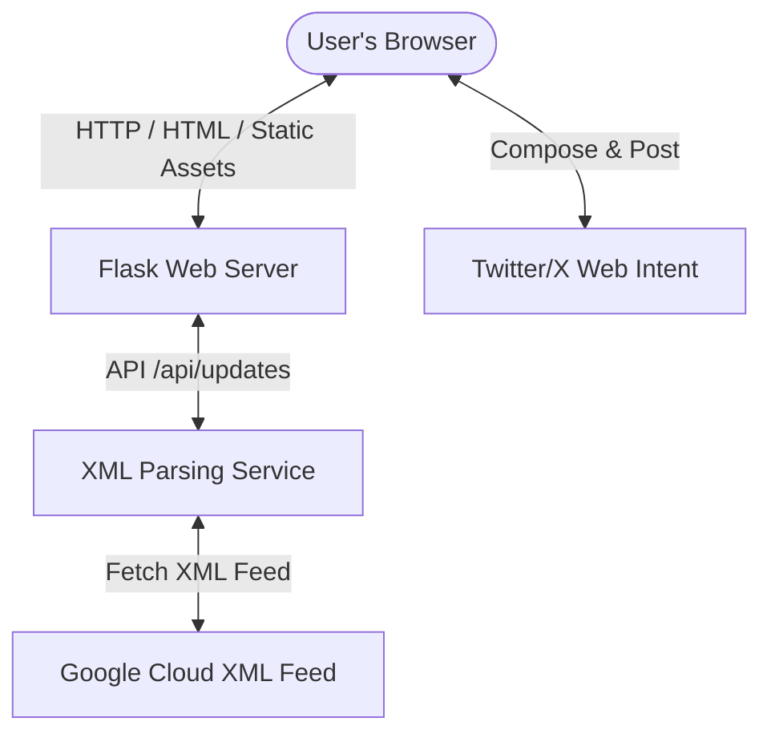

# Implementation Plan: BigQuery Release Notes Tracker

This document details the architecture, design aesthetics, components, and verification steps for the BigQuery Release Notes Web Application.

---

## 1. System Architecture

The application is structured as a lightweight, single-page web application with a Python Flask backend serving a rich HTML5, CSS3, and JavaScript frontend.

### Backend (Python Flask)
* **Web Server (`app.py`)**: Runs on local port `5000` to serve the home route `/` and handles API requests.
* **RSS XML Parsing**: Uses Python's standard `xml.etree.ElementTree` to parse the Atom feed from Google Cloud with robust namespace support (`http://www.w3.org/2005/Atom`).
* **HTML Content Extraction**: Utilizes `BeautifulSoup` to break down multi-topic daily entries (e.g. entries with multiple features, deprecations, or issues) into individual, selectable records grouped by date.

### Frontend (HTML5 / JavaScript / Vanilla CSS)
* **Single Page Layout**: A responsive two-column grid. Left side holds the release notes feed and search/filter tools; right side houses the sticky Twitter Composer panel.
* **Client-Side Processing**: Fast search filtering, category filtering, card selection highlights, and character limit validations implemented in vanilla JavaScript.
* **Twitter Integration**: Employs Twitter Web Intents (`https://twitter.com/intent/tweet?text=...`) to allow immediate, safe posting from the user's active session without requiring server-side API keys.

---

## 2. Design System & Aesthetics

The interface adopts a high-end, developer-centric dashboard design style:

* **Dark Color Scheme**: Utilizing a deep slate-navy canvas (`#070a13`) to prevent eye fatigue, paired with translucent glassmorphic containers (`#151e36`) and glowing borders (`#223156`).
* **Google Cloud Inspired Accents**: Vibrant blue (`#3b82f6`) and indigo (`#6366f1`) gradients represent active selection states and brand identity.
* **Semantic Update Badges**:
  * `Feature` (Green): `rgba(16, 185, 129, 0.1)` bg with `#34d399` text.
  * `Announcement` (Yellow): `rgba(245, 158, 11, 0.1)` bg with `#fbbf24` text.
  * `Issue` (Red): `rgba(239, 68, 68, 0.1)` bg with `#f87171` text.
  * `Deprecation` (Purple): `rgba(168, 85, 247, 0.1)` bg with `#c084fc` text.
* **Premium Typography**: Uses the modern sans-serif fonts **Outfit** (headings, bold, futuristic) and **Inter** (body text, clean, readable) via Google Fonts.
* **Animations**:
  * Spin/rotation transitions for the refresh action.
  * Subtle hover lift transitions (`translateY(-2px)`) on update cards.
  * Pulse animations for loading states and floating indicators.

---

## 3. Component Details

| Component | Description | Key Features |
| :--- | :--- | :--- |
| **Main Header** | Brand title and actions bar. | Integrated loading status dot, last-refresh timestamp indicator, and animated "Làm mới" refresh button. |
| **Filters & Search Bar** | Navigation tools for fast updates retrieval. | Input search text field, filter chips category toggle (All, Feature, Announcement, etc.). |
| **Updates Feed** | Core dashboard displaying individual release notes. | Selectable update cards with type-colored border indicators, original document links, and checkbox markers. |
| **Tweet Composer** | Side-docked workspace for draft composing. | Real-time editable textarea, auto-populated tweet structure based on the selected update, active character countdown (max 280). |
| **SVG Progress Ring** | Visual circular timer for characters remaining. | Dynamic color transitions (blue -> orange -> red) as characters approach and exceed the limit. |
| **Tweet Preview Card** | Real-time replica of how the post appears on X. | Avatar icon, styled handle metadata, formatted message body, and mock webpage link preview. |

---

## 4. Verification Steps

To verify the app is fully functional, complete the following QA steps:

1. **Verify Backend Startup**:
   * Run the Flask server and check if it binds successfully to `http://127.0.0.1:5000/`.
   * Access `/api/updates` in a browser or API client to ensure the XML parses successfully into a clean JSON array structure.

2. **Verify Interface Load**:
   * Navigate to `http://127.0.0.1:5000/`.
   * Verify that the loading screen appears, followed by the immediate rendering of the cards grid.

3. **Verify Refreshes & Loaders**:
   * Click **"Làm mới"** and confirm that the refresh icon spins smoothly, the status updates to "Đang tải...", and the timestamp refreshes once completed.

4. **Verify Filters and Search**:
   * Type a keyword (e.g. "Gemini", "autoscaling") in the search input and verify cards filter instantly.
   * Toggle the filter chips (e.g. select "Feature" or "Issue") and confirm only matching categories display.

5. **Verify Selection & Tweet Dispatch**:
   * Click an update card. Confirm it is highlighted with a glowing border.
   * Verify the tweet text field and preview auto-populate with the correct date, category, text description snippet, and link.
   * Edit the text to exceed 280 characters and verify the progress indicator turns red, and the tweet button disables.
   * Adjust back, click **"Đăng Tweet"**, and confirm it triggers a new browser window opening to Twitter's tweet composer with the exact text pre-filled.
