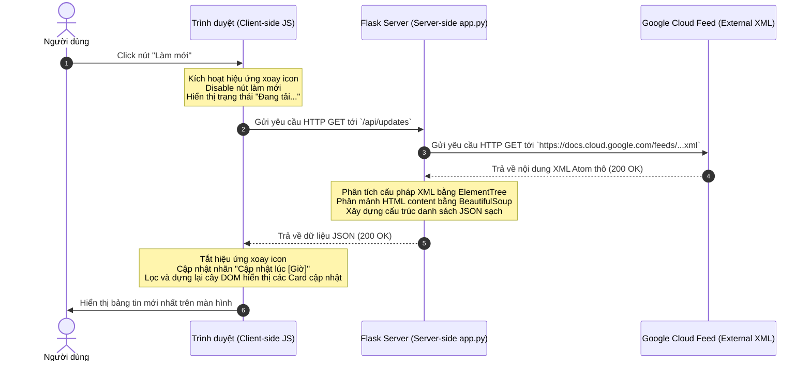

# Phân Tích Kiến Trúc Chi Tiết: BigQuery Release Notes Web Application

Tài liệu này cung cấp cái nhìn chi tiết về kiến trúc của ứng dụng, phân tách các tính năng chính thành phía máy chủ (Server-side) và phía máy khách (Client-side), đồng thời minh họa luồng xử lý Yêu cầu - Phản hồi (Request - Response).

---

## 1. Phân Tách Tính Năng Theo Kiến Trúc

### A. Phía Máy Chủ (Server-Side - Python Flask)
Máy chủ chịu trách nhiệm về tính toàn vẹn dữ liệu, giao tiếp với các dịch vụ bên ngoài của Google Cloud và cung cấp dữ liệu sạch cho trình duyệt.

1. **Routing & Phục vụ Tài nguyên Tĩnh:**
   * Cung cấp trang giao diện chính tại tuyến đường `/` thông qua hàm `render_template`.
   * Phục vụ các tài nguyên tĩnh như CSS ([style.css](file:///C:/Users/ngodn/bigquery-updates-app/static/css/style.css)) và JavaScript ([app.js](file:///C:/Users/ngodn/bigquery-updates-app/static/js/app.js)).
2. **Thu thập dữ liệu XML (Ingestion):**
   * Sử dụng thư viện `requests` để gửi truy vấn HTTP GET tới RSS XML Feed của Google Cloud.
   * Cấu hình thời gian chờ (`timeout=15`) để xử lý lỗi mạng kịp thời.
3. **Phân tích cú pháp XML (Feed Parsing):**
   * Sử dụng `xml.etree.ElementTree` để duyệt qua cấu trúc XML Atom của Google Cloud.
   * Xử lý không gian tên (namespace URL) nhằm định vị chính xác dữ liệu của các thẻ `<entry>`, `<title>`, `<updated>`, và `<content>`.
4. **Chuẩn hóa và Tách Nhỏ Dữ liệu (HTML Normalization & Splitting):**
   * Dùng `BeautifulSoup` phân tách nội dung HTML tổng thể của một ngày thành các bản ghi nhỏ hơn dựa trên thẻ tiêu đề đầu mục `<h3>` (ví dụ: chia tách `Feature`, `Issue`, `Announcement` trong cùng một ngày).
   * Tạo định danh ID duy nhất cho từng mục cập nhật để hỗ trợ việc chọn lựa ở phía máy khách.
   * Chuyển đổi HTML thành văn bản thuần để làm tư liệu tóm tắt soạn thảo Tweet.

---

### B. Phía Máy Khách (Client-Side - HTML5, CSS3, JS)
Máy khách chịu trách nhiệm hiển thị trực quan dữ liệu, quản lý trạng thái tương tác và chuẩn bị nội dung chia sẻ mạng xã hội.

1. **Hiển thị Bảng tin (Rendering Engine):**
   * Nhận dữ liệu JSON từ API máy chủ và dựng cây DOM động để tạo các thẻ cập nhật (cards).
   * Áp dụng phong cách thẻ riêng biệt dựa trên thể loại cập nhật (vd: viền xanh lá cho Feature, viền đỏ cho Issue).
2. **Tìm kiếm & Lọc Dữ liệu (Client-side Search & Filtering):**
   * Lọc tức thì các bản ghi dựa trên từ khóa tìm kiếm (theo ngày, tiêu đề, nội dung) mà không cần tải lại trang.
   * Lọc theo danh mục dựa trên các chip điều hướng.
3. **Quản lý Trạng thái Lựa chọn (Selection Management):**
   * Ghi nhận thẻ đang được chọn và kích hoạt hiệu ứng phát sáng viền CSS.
   * Kích hoạt và chuyển đổi hiển thị của bảng soạn thảo Twitter từ trạng thái trống (Empty state) sang hoạt động (Active state).
4. **Trình soạn thảo & Bộ đếm Ký tự Thông minh (Live Editor & Progress Ring):**
   * Tự động tạo bản nháp tweet chuẩn hóa về định dạng và giới hạn từ ngữ.
   * Tính toán chiều dài ký tự thời gian thực, cập nhật vòng tròn tiến trình SVG và thay đổi màu sắc trực quan (Xanh lá -> Cam -> Đỏ) tùy mức độ giới hạn (280 ký tự).
   * Khóa tính năng đăng bài khi vượt quá giới hạn ký tự cho phép.
5. **Giao tiếp X (X/Twitter Web Intent Integration):**
   * Sử dụng Twitter Web Intents để tạo liên kết động chuyển hướng an toàn sang trang đăng bài chính thức của X.

---

## 2. Ví Dụ Về Luồng Xử Lý (Processing Flow)

Dưới đây là sơ đồ tuần tự thể hiện cách thức hoạt động của yêu cầu và phản hồi khi người dùng nhấn nút **"Làm mới" (Refresh)**:



---

## 3. Cấu Trúc Yêu Cầu và Phản Hồi Thực Tế (API Payload)

Khi Trình duyệt gửi yêu cầu lấy dữ liệu:
* **Phương thức:** `GET`
* **Đường dẫn (Endpoint):** `http://127.0.0.1:5000/api/updates`

### Định dạng Phản hồi (JSON Response):
Mã phản hồi HTTP là `200 OK` đi kèm nội dung JSON có cấu trúc mảng danh sách như sau:

```json
[
  {
    "id": "tag:google.com,2016:bigquery-release-notes#June_17_2026_0",
    "date": "June 17, 2026",
    "updated": "2026-06-17T00:00:00-07:00",
    "link": "https://docs.cloud.google.com/bigquery/docs/release-notes#June_17_2026",
    "type": "Feature",
    "content_html": "<p>You can enable <a href=\"https://docs.cloud.google.com/bigquery/docs/autonomous-embedding-generation\">autonomous embedding generation</a> on new or existing tables...</p>",
    "content_text": "You can enable autonomous embedding generation on new or existing tables..."
  },
  {
    "id": "tag:google.com,2016:bigquery-release-notes#June_15_2026_0",
    "date": "June 15, 2026",
    "updated": "2026-06-15T00:00:00-07:00",
    "link": "https://docs.cloud.google.com/bigquery/docs/release-notes#June_15_2026",
    "type": "Issue",
    "content_html": "<p>Support for configuring daily token quotas for BigQuery generative AI functions has been temporarily disabled...</p>",
    "content_text": "Support for configuring daily token quotas for BigQuery generative AI functions has been temporarily disabled..."
  }
]
```

### Cách thức Xử lý Phản Hồi của JavaScript Phía Máy Khách:
1. Duyệt qua từng đối tượng trong mảng phản hồi.
2. Kiểm tra bộ lọc hiện tại:
   * Nếu người dùng chọn lọc loại là `Feature`, chỉ lấy các mục có thuộc tính `"type": "Feature"`.
   * Nếu người dùng tìm kiếm từ khóa `"embedding"`, kiểm tra xem chuỗi `"embedding"` có tồn tại trong `"content_text"` hay không.
3. Chuyển đổi mã HTML trong `"content_html"` trực tiếp vào thuộc tính `.innerHTML` của thẻ `.card-body` để giữ nguyên các thẻ định dạng và các đường dẫn siêu liên kết `<a href="...">` của Google Cloud.
